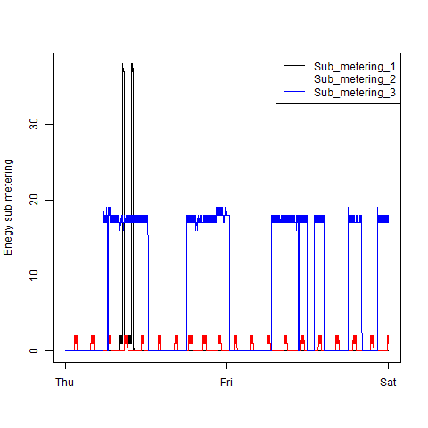
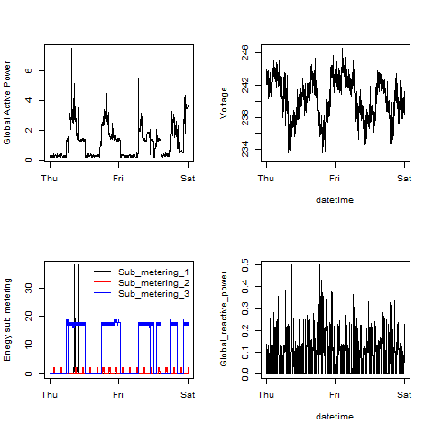

## Introduction

This assignment uses data from
the <a href="http://archive.ics.uci.edu/ml/">UC Irvine Machine
Learning Repository</a>, a popular repository for machine learning
datasets. In particular, we will be using the "Individual household
electric power consumption Data Set" which I have made available on
the course web site:

* <b>Dataset</b>: <a href="https://d396qusza40orc.cloudfront.net/exdata%2Fdata%2Fhousehold_power_consumption.zip">Electric power consumption</a> [20Mb]

* <b>Description</b>: Measurements of electric power consumption in
one household with a one-minute sampling rate over a period of almost
4 years. Different electrical quantities and some sub-metering values
are available.

The following descriptions of the 9 variables in the dataset are taken
from
the <a href="https://archive.ics.uci.edu/ml/datasets/Individual+household+electric+power+consumption">UCI
web site</a>:

<ol>
<li><b>Date</b>: Date in format dd/mm/yyyy </li>
<li><b>Time</b>: time in format hh:mm:ss </li>
<li><b>Global_active_power</b>: household global minute-averaged active power (in kilowatt) </li>
<li><b>Global_reactive_power</b>: household global minute-averaged reactive power (in kilowatt) </li>
<li><b>Voltage</b>: minute-averaged voltage (in volt) </li>
<li><b>Global_intensity</b>: household global minute-averaged current intensity (in ampere) </li>
<li><b>Sub_metering_1</b>: energy sub-metering No. 1 (in watt-hour of active energy). It corresponds to the kitchen, containing mainly a dishwasher, an oven and a microwave (hot plates are not electric but gas powered). </li>
<li><b>Sub_metering_2</b>: energy sub-metering No. 2 (in watt-hour of active energy). It corresponds to the laundry room, containing a washing-machine, a tumble-drier, a refrigerator and a light. </li>
<li><b>Sub_metering_3</b>: energy sub-metering No. 3 (in watt-hour of active energy). It corresponds to an electric water-heater and an air-conditioner.</li>
</ol>

## Loading the data

* To reproduce plots making dataset file must be located in R working directory. It can be downloaded by <a href="https://d396qusza40orc.cloudfront.net/exdata%2Fdata%2Fhousehold_power_consumption.zip">the link</a>.

* The raw dataset in file has 2,075,259 rows and 9 columns.

* We only use data from the dates 2007-02-01 and
2007-02-02. So the scripts read the data from just those dates.

* The Date and Time variables are converted to Date/Time classes in R using the `strptime()` and `as.Date()`
functions.

* Dataset missing values are coded as `?`.

## Making Plots

Our overall goal here is simply to examine how household energy usage
varies over a 2-day period in February, 2007. The task is to
reconstruct the example plots in `figue` folder, all of which were constructed
using the base plotting system.

Examples were forked from the following GitHub repository:
[https://github.com/rdpeng/ExData_Plotting1](https://github.com/rdpeng/ExData_Plotting1)

For each plot:

* Constructed the plot and saved to a PNG file with a width of 480
pixels and a height of 480 pixels.

* Each of the plot files is named as `plot1.png`, `plot2.png`, etc.

* Created a separate R code file (`plot1.R`, `plot2.R`, etc.) that
constructs the corresponding plot, i.e. code in `plot1.R` constructs
the `plot1.png` plot. Code file includes code for reading
the data so the plot can be fully reproduced. Also the code that creates the PNG file is included.

* The PNG file and R code file added to git repository.

The four plots from task examples and that are made by R scripts are shown below. 

## Sample Plots

### Plot 1

 

### Plot 2

 

### Plot 3

 

### Plot 4

 

## Plots made by R scripts

### Plot 1

 

### Plot 2

 

### Plot 3

 

### Plot 4

